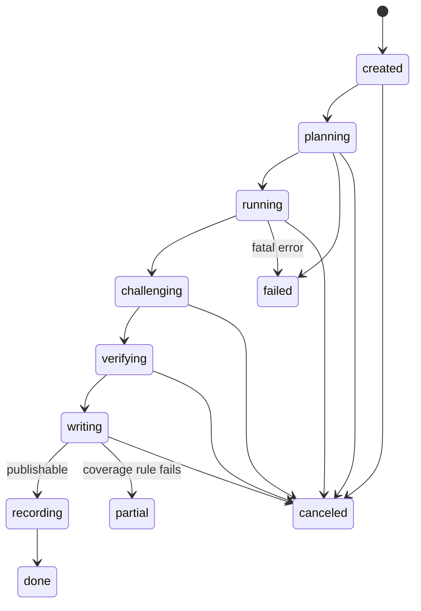

# 06 — Swarm and Pipelines

Status: Draft v2 · 2026-09-24 · Depends on: 00, 02, 04, 05, 07, 08. Phase 3.

## 1. Purpose and scope

This spec defines how Herness turns one review request or one chat question into bounded, parallel agent tasks, runs them adversarially, and produces a verified report draft plus recommendations.

In scope:
- `herness/harness/swarm.py`: run lifecycle, planner step, fan-out scheduler, spawn broker, adversarial layer, dedup, writer step, run-end hand-offs.
- `herness/harness/blackboard.py`: the Blackboard API over the ops `finding` table.
- `herness/harness/pipelines/`: `funding_review.py`, `org_review.py`, `chat.py` (including `ChatService`).
- Shared types owned here (spec 00 §6): `TaskSpec`, `EntityScope`, `TaskInputs`, `TaskBudget`, `Finding`, `Challenge`, `CheckResult`, `CrossCheck`, `VerificationRecord`, `ReportDraft` (+ `Section`, `Paragraph`, `RecommendationItem`, `RankedEntity`), `ChatAnswer`, `ChatEvent`, `Coverage`.
- Ops tables owned here (spec 02 §5.3): `run`, `task` (mechanics: spec 08), `finding`.
- Config file `config/pipelines.yaml` (spec 00 §11).

Out of scope, referenced only:
- `run_agent`, LLM clients, tools, role prompts, `NumberRef`, `VerificationResult` and the Verifier algorithm (spec 05).
- Memory layers, compaction, `recommendation` semantics (spec 07).
- Retries, fallback chain, job queue, GPU classes, task recovery and checkpoint envelope (spec 08).
- Scores and the portfolio optimizer (spec 04). Report rendering and chat UI (spec 09). Redaction and egress guard (spec 10).

## 2. Responsibilities

1. Create, drive, resume and close `run` rows for `funding_review`, `org_review` and `chat` runs.
2. Build a task plan: deterministic candidate selection from `score.*` plus model-generated hypotheses and framing.
3. Execute tasks in parallel under per-backend concurrency gates, per-task budgets and a run-wide budget.
4. Approve or deny sub-task requests from Analysts (depth, count, budget, dedup rules).
5. Maintain the blackboard: commit findings idempotently, run status transitions, dedup overlapping findings.
6. Route top findings to Skeptics, run revision rounds, gate every finding through Verifier gate 1 (spec 05).
7. Run the Writer, gate the draft through Verifier gate 2, write `data/reports/<run_id>/draft.json`.
8. At run end: hand recommendations to spec 07, fill `rec_id` into the draft, trigger procedural promotion and rendering.
9. Apply depth mode (`fast | standard | deep`) and profile (`local | hybrid | premium`) knobs.
10. Answer chat turns through `ChatService`, including escalation to a mini swarm.

## 3. Interfaces

### 3.1 Swarm entry points (`herness/harness/swarm.py`)

```python
RunKind = Literal["funding_review", "org_review", "chat"]
Depth = Literal["fast", "standard", "deep"]

class RunRequest(BaseModel):
    kind: RunKind
    depth: Depth = "standard"
    profile: str | None = None            # None = active profile (spec 10)
    question: str | None = None           # required for chat; optional framing for reviews
    focus: EntityScope | None = None      # restricts deterministic selection to these entities (spec 11 golden suite)
    scenarios: list[Scenario | str] = []  # spec 04; [] = pipelines.yaml portfolio_scenario; --budget USD → Scenario("custom_<usd>")
    build_id: str | None = None           # None = contents of data/warehouse/CURRENT at start
    session_id: str | None = None         # chat escalation only
    budget_override: dict | None = None   # keys of DepthKnobs, e.g. {"max_tasks_per_run": 60}

class RunResult(BaseModel):
    run_id: str
    status: str                           # final run.status (§5.1)
    draft_path: str | None
    coverage: Coverage
    dead_task_ids: list[str]
    token_usage: dict
    cost_usd: Decimal

class Swarm:
    def __init__(self, cfg: PipelinesConfig, ops: OpsStore, llms: LLMRegistry, memory: MemoryStore) -> None: ...
    async def start(self, req: RunRequest, job: JobContext | None = None) -> RunResult: ...
    async def resume(self, run_id: str, job: JobContext | None = None, *, force: bool = False) -> RunResult: ...
    async def cancel(self, run_id: str) -> None: ...

def review_job_handler(ctx: JobContext) -> JobOutcome: ...   # registered with spec 08 register_handler("review", ...)
```

`review_job_handler` reads `ctx.payload` (`{"request": RunRequest}` for a new run, `{"run_id": ..., "resume": true}` for continuations), runs `asyncio.run(...)`, and returns `JobOutcome("done", {"run_id", "status", "partial"})` or `JobOutcome("yield", ...)` when `ctx.should_yield()` fired. The original `RunRequest` is stored in `run.meta.request`.

### 3.2 Calls into other specs (spec 00 §12.3)

| Callee | Interface | Used in |
|--------|-----------|---------|
| 05 | `run_agent(role, task_input, ctx, client, profile, hooks, resume_from=None) -> AgentResult`, with `hooks = HarnessHooks(...)` built per task (§3.3) | every agent task (§5.3), chat |
| 05 | `verify_findings(findings, build_id)`, `verify_draft(draft, build_id)`, `verify_answer(answer, build_id)` → `VerificationResult` per item | gate 1, gate 2, chat |
| 07 | `MemoryStore.prior_context(run_ctx) -> str` | planner and writer input |
| 07 | `MemoryStore.write_recommendations(run_id, recs) -> list[rec_id]` (idempotent per `run_id`) | record step |
| 07 | `MemoryStore.promote_procedural(run_id)` | record step |
| 07 | `MemoryStore.compactor(profile, *, ctx)` | `HarnessHooks` compactor (spec 05) |
| 08 | `recover_run_tasks(run_id, max_task_attempts=..., retry_dead=...)`, `claim_task`, `save_checkpoint`, `complete_task`, `fail_task` | task lifecycle |
| 08 | `ModelChain` (spec 08 §3.2, passed into `HarnessHooks`), `JobContext.should_yield/gpu_scope/heartbeat`, `jobs.enqueue`, `jobs.chat_policy`, `jobs.chat_model_profile`, `jobs.chat_next_live_at` | budgets, calls, deep large stage, chat routing, escalation |
| 04 | `optimize_portfolio(scenario, persist=False, build_id=..., run_id=...)` | custom budget scenarios |
| 09 | `render_run(run_id, formats)` | last step of a review |

### 3.3 Loop hooks (spec 05 `HarnessHooks`, one per task)

This spec has no hooks class of its own. Per task it constructs spec 05 `HarnessHooks`:

```python
hooks = HarnessHooks(registry=self.llms, gates=self._gates,                 # call gates owned here
                     chain=ModelChain(spec.model_role, registry=self.llms, depth=run.depth, gpu=gpu_state()),
                     compactor=self.memory.compactor(profile, ctx=ctx),      # spec 07
                     task_id=t.task_id, phase=t.phase, stop=self._stop,      # checkpoint; cancel/preempt flag
                     on_text_delta=None,                                     # ChatService sets it (§5.13)
                     tracer=tracer)
# spec 08: async ModelChain.acomplete(req, *, schema: type[BaseModel] | None = None,
#     client_for: Callable[[str], LLMClient], tracer: Tracer | None = None) -> tuple[LLMResponse, BaseModel | None]
```

`HarnessHooks.call` calls `ModelChain.acomplete` with `client_for` wrapping each client in `GatedClient` with this spec's gate; `on_loop_signal` uses spec 08 `loop_signal_policy`; `after_step` calls spec 08 `save_checkpoint` (key `scratchpad` untouched) and raises `CancelledError` when `stop()` is true. Gates are keyed by client name in `config/models.yaml` (e.g. `local-30b`); size = `models.yaml: clients.<name>.max_concurrency` (spec 05), minus `chat_reserved_slots` (spec 08 §5.10) when the run executes during the chat window.

### 3.4 Pipeline protocol (`herness/harness/pipelines/base.py`)

```python
class Pipeline(Protocol):
    kind: RunKind
    def deterministic_tasks(self, ctx: PlanContext) -> list[TaskSpec]: ...
    def must_cover(self, ctx: PlanContext) -> set[str]: ...          # "<entity_type>:<entity_id>"
    def planner_input(self, ctx: PlanContext, tasks: list[TaskSpec]) -> dict: ...
    def challenge_priority(self, f: Finding, ctx: PlanContext) -> float: ...
    def writer_input(self, ctx: PlanContext, verified: list[Finding]) -> dict: ...
    def ranked_entities(self, draft: ReportDraft) -> list[RankedEntity]: ...
    def recommendation_drafts(self, draft: ReportDraft, findings: dict[str, Finding]) -> list[RecommendationDraft]: ...

class PlanContext(BaseModel):
    run_id: str; kind: RunKind; depth: Depth; profile: str; build_id: str
    question: str | None; focus: EntityScope | None
    knobs: DepthKnobs                        # resolved from pipelines.yaml + budget_override (§7)
    dq_warnings: list[dict]                  # meta.dq_result rows with passed = false
    unconfirmed_weights: list[str]           # weights.yaml keys with unconfirmed: true (spec 04)
    prior_context: str                       # MemoryStore.prior_context(...) rendered block
    prior_recs: list[dict]                   # ops recommendation + latest outcome, same kind, last 2 runs
    portfolio: dict                          # PortfolioResult (custom) or score.portfolio rows, with query_ids
```

### 3.5 Blackboard (`herness/harness/blackboard.py`)

```python
class FindingFilter(BaseModel):
    run_id: str
    status: set[str] | None = None
    entity_type: str | None = None
    entity_ids: set[str] | None = None
    task_ids: set[str] | None = None
    author_roles: set[str] | None = None
    min_confidence: float | None = None
    include_superseded: bool = False          # default hides status in {revised, merged}
    limit: int = 500

class Blackboard:
    def __init__(self, ops: OpsStore, run_id: str) -> None: ...
    def post(self, ctx: ToolContext, **args) -> str: ...          # `post_finding` tool backend (spec 05)
    async def list_findings(self, flt: FindingFilter) -> list[Finding]: ...
    async def challenge(self, finding_id: str, ch: Challenge, *, revision: TaskSpec | None = None) -> bool: ...
    async def mark_verified(self, finding_id: str, v: VerificationRecord) -> bool: ...
    async def reject(self, finding_id: str, reason: RejectReason, v: VerificationRecord | None = None) -> bool: ...
    async def supersede(self, old_id: str, new: Finding) -> str: ...
    async def merge(self, keep_id: str, dup_ids: list[str]) -> None: ...
```

`bool` results are compare-and-set: `False` means the finding was not in an allowed source status (§6.5) and nothing changed.

`post` validates the finding (§4.2), then commits it with `save_checkpoint(task_id, checkpoint, writes=insert_finding)` (spec 08), so the finding row and the checkpoint's `finding_ids` land in one transaction. A resumed task never re-posts a committed finding. Findings are visible to other tasks as soon as they commit.

### 3.6 Swarm-provided tools (registered in the spec 05 tool registry)

| Tool | Roles | Effect |
|------|-------|--------|
| `post_finding` | analyst | Schema per spec 05 §5.4.2; backend `Blackboard.post`. Returns `finding_id`. |
| `list_findings(filter)` | analyst, skeptic, writer | Committed findings of the current run (`FindingFilter` minus `run_id`); chat sees `verified` findings of past runs. |
| `request_subtask(objective, specialty, entity_type, entity_ids, reason)` | analyst | `SpawnBroker.request` (§5.5). Returns `{approved: true, task_id}` or `{approved: false, reason}`. Never blocks on the child. |
| `escalate(question, reason)` | chat | Starts a mini swarm (§5.13). Returns `{run_id, job_id}`. |

### 3.7 ChatService (`herness/harness/pipelines/chat.py`, consumed by spec 09)

```python
class ChatService:
    def __init__(self, cfg: PipelinesConfig, ops: OpsStore, llms: LLMRegistry, memory: MemoryStore) -> None: ...
    def answer(self, session_id: str, text: str, user_ref: str, mode: ChatMode) -> Iterator[ChatEvent]: ...
```

`answer` is a synchronous generator (Streamlit and the terminal consume it). It runs the async chat loop in a worker thread and relays events through a `queue.Queue`. `mode` comes from spec 08 `jobs.chat_policy(now)`.

## 4. Data contracts

All models are pydantic v2 in `herness/core/types.py`. `NumberRef` and `VerificationResult` are imported from spec 05. Numbers in model-written text follow spec 00 §12.1: markers `[[<id>]]`, `id` matching `n[0-9]+`, unique within the object that carries the text, resolved against that object's `numbers`. Fields that point at a number hold its `id` string.

### 4.1 TaskSpec (stored as `task.spec`)

```python
Role = Literal["planner", "judge", "analyst", "skeptic", "verifier", "writer", "chat"]   # = task.role (spec 02)
Specialty = Literal["ops", "change", "delivery", "org", "crosscheck", "retrospective", "general"]

class EntityScope(BaseModel):
    entity_type: Literal["service", "team", "org", "work_item", "cluster", "candidate", "run"]
    entity_ids: list[str]                    # 1..50; "candidate" ids = score.funding.candidate_id
    period_start: date | None = None         # default: pipeline window (§7)
    period_end: date | None = None

class TaskInputs(BaseModel):
    finding_ids: list[str] = []              # skeptic targets, revision source, writer inputs
    query_ids: list[str] = []                # evidence the task starts from
    candidate_ids: list[str] = []
    memory_ids: list[str] = []
    dq_warnings: list[str] = []              # meta.dq_result.check_name values
    notes: str | None = None                 # planner framing, ≤ 1,500 chars

class TaskBudget(BaseModel):
    max_steps: int
    max_tokens: int                          # prompt + completion over all calls of the task
    max_cost_usd: Decimal = Decimal("0")     # 0 = no paid calls
    wall_clock_s: int
    def to_budgets(self, now: datetime) -> Budgets: ...   # spec 05 Budgets (deadline = now + wall_clock_s)

class TaskSpec(BaseModel):
    task_id: str                             # task_<ulid>
    run_id: str
    role: Role
    specialty: Specialty = "general"
    objective: str                           # ≤ 2,000 chars
    scope: EntityScope
    inputs: TaskInputs = TaskInputs()
    tools: list[str]                         # ⊆ spec 05 RoleSpec.tools for the mapped role
    budget: TaskBudget
    depth: int = 0                           # spawn depth 0..2 (not the run depth mode)
    parent_task_id: str | None = None
    priority: float = 0.0
    model_role: str                          # routing key in models.yaml profile roles (§5.11)
    must_cover: bool = False
    dedup_key: str                           # unique per run (spec 02 index)
    revision_of: str | None = None           # finding_id being revised
    round: int = 0                           # skeptic/revision round, 0 = original analysis
    k_samples: int = 1                       # self-consistency samples for this task's verdict
```

Spec 05 role mapping (`RoleSpec.name`, one prompt file per analyst specialty): `analyst` + `ops|change|delivery|org|crosscheck|retrospective` → `analyst_ops`, `analyst_change`, `analyst_delivery`, `analyst_org`, `analyst_crosscheck`, `analyst_retrospective`; `general` → `analyst_general`; other roles map 1:1 (`planner`, `judge`, `skeptic`, `writer`, `chat`). Routing keys `skeptic_final` and `chat_off_hours` (§5.11) select a different model only; they reuse the `skeptic` and `chat` prompts.

`task.result`: `{"summary", "finding_ids", "partial": bool, "stop_cause", "tokens", "cost_usd", "subtasks"}`. Planner adds `"plan"` (TaskSpec list), judge adds `"choice"`, `"scores"`, writer adds `"draft_path"`, revision tasks add `"withdrawn": bool`. `task.checkpoint` uses the spec 08 envelope; `phase` values are the run statuses of §5.1; key `scratchpad` is reserved for spec 07; `state` holds role data (e.g. the hybrid pseudonym map).

### 4.2 Finding (1:1 with ops `finding`)

```python
class Finding(BaseModel):
    finding_id: str                          # fnd_<ulid>
    run_id: str
    task_id: str
    author_role: Role
    claim: str                               # ≤ 1,500 chars; numbers only as [[<id>]] markers
    entity_type: str                         # EntityScope.entity_type vocabulary
    entity_id: str
    numbers: list[NumberRef]                 # spec 05; 1..20 items
    query_ids: list[str]                     # ⊇ {n.query_id for n in numbers}
    confidence: float                        # 0..1
    status: Literal["proposed", "challenged", "verified", "rejected", "revised", "merged"] = "proposed"
    challenge: list[Challenge] = []          # append-only history
    verification: VerificationRecord | None = None
    supersedes: str | None = None
    merged_into: str | None = None
    created_at: datetime
```

Validation in `Blackboard.post` (failures raise `ToolInputError`, returned to the agent):
- every marker resolves to a `NumberRef.id`, ids are unique, every `NumberRef` is referenced;
- numerals outside markers match `config/app.yaml: reports.allowed_numeral_patterns` (spec 00 §12.1);
- every `query_id` exists in ops `evidence` with the run's `build_id`, or in warehouse `meta.evidence`;
- `entity_id` exists in the warehouse table for `entity_type` (one indexed lookup);
- redaction check (spec 10 PII patterns) on `claim`.

`impact_usd(f) = max(Decimal(n.value) for n in f.numbers if n.unit == "usd")`, 0 if none.

### 4.3 Challenge and verification records

```python
SkepticCheck = Literal["confounding", "seasonality", "mis_mapping", "small_sample",
                       "double_counting", "survivorship"]

class CheckResult(BaseModel):
    check: SkepticCheck
    result: Literal["pass", "concern", "fail", "n_a"]
    note: str                                # ≤ 400 chars, markers allowed
    numbers: list[NumberRef] = []
    query_ids: list[str] = []                # required when result in {concern, fail}

class Challenge(BaseModel):                  # Skeptic role output schema (spec 05 role table)
    finding_id: str
    round: int
    skeptic_task_id: str
    checks: list[CheckResult]                # exactly one per SkepticCheck
    verdict: Literal["uphold", "revise", "reject"]
    required_actions: list[str] = []         # required when verdict == "revise"
    votes: dict[str, int] | None = None      # self-consistency tallies
    model: str                               # model profile that produced the verdict

class CrossCheck(BaseModel):
    number_id: str                           # NumberRef.id in the finding
    query_ids: list[str]                     # independent computations, distinct query_ids
    values: list[float]
    agreed: bool

class VerificationRecord(BaseModel):         # stored in finding.verification
    gate: Literal[1]
    result: VerificationResult               # spec 05, verbatim
    cross_checks: list[CrossCheck] = []
    reason: str | None = None                # set on rejection
```

`RejectReason = Literal["skeptic_reject", "verifier_fail", "crosscheck_disagree", "withdrawn", "revision_dead"]`.

### 4.4 ReportDraft (`data/reports/<run_id>/draft.json`, spec 00 §12.2)

The Writer returns the model-authored fields (`title`, `sections`, `recommendations` without `rec_id`/`rank`, `caveats`, `prior_outcomes_commentary`), validated against `ReportDraft.writer_schema()` (the JSON Schema of `ReportDraft` restricted to those fields). The swarm fills the rest.

```python
class Paragraph(BaseModel):
    text: str                                # [[<id>]] markers only
    numbers: list[NumberRef]
    finding_ids: list[str]                   # ≥ 1 when numbers is non-empty

class Section(BaseModel):
    id: Literal["executive_summary", "recommendations", "portfolio", "org_scorecards",
                "actions", "retrospective", "risks_and_caveats", "method"]   # = spec 09 outline slots
    title: str
    paragraphs: list[Paragraph]

class RecommendationItem(BaseModel):
    rank: int                                # set by the swarm from Writer order
    rec_id: str | None = None                # filled after MemoryStore.write_recommendations
    kind: Literal["fund", "org_action"]
    target_type: str                         # score.funding.candidate_type for fund; team|service|org for org_action
    target_id: str
    headline: str                            # ≤ 120 chars, markers allowed
    summary: str                             # ≤ 600 chars rationale, markers only
    numbers: list[NumberRef]
    expected_metric: str | None = None       # org_action: score.action_lever.metric
    expected_delta_ref: str | None = None    # NumberRef.id
    expected_usd_ref: str | None = None      # NumberRef.id, unit usd
    confidence_ref: str | None = None        # NumberRef.id, fund: score.funding.confidence
    effort_usd_ref: str | None = None        # NumberRef.id, fund: score.funding.effort_cost_usd
    action_levers: list[dict] = []           # {entity_type, entity_id, metric, delta_usd_ref}
    finding_ids: list[str]                   # ≥ 1, all verified
    query_ids: list[str]                     # union of numbers[].query_id and cited findings' query_ids

class RankedEntity(BaseModel):
    rank: int
    entity_type: str                         # "candidate" (funding) | "team" | "service" | "org"
    entity_id: str

class Coverage(BaseModel):
    planned_tasks: int; done_tasks: int; dead_tasks: int
    must_cover_total: int; must_cover_done: int
    verified_findings: int; rejected_findings: int
    publishable: bool

class ReportDraft(BaseModel):
    schema_version: Literal["1"] = "1"
    run_id: str; kind: RunKind; depth: Depth; profile: str; build_id: str
    title: str
    sections: list[Section]
    recommendations: list[RecommendationItem]
    ranked_entities: list[RankedEntity]      # = recommendation order by target (spec 11 grading)
    caveats: list[str]                       # markers allowed only with numbers in the owning paragraph
    prior_outcomes_commentary: Paragraph | None
    portfolio_custom: list[dict] = []        # PortfolioResult JSON per custom scenario (not in score.portfolio)
    banners: list[Literal["dq_warnings", "unconfirmed_weights", "partial_run", "hybrid_fallback",
                          "budget_exhausted"]]
    flags: dict[str, list[str]]              # {"partial_coverage": ["team:<id>", ...], "notes": [...]}
    contested: list[str]                     # finding_ids rejected by skeptics
    removed: list[dict]                      # items dropped by gate 2: {"where", "reason"}
    coverage: Coverage
    dead_tasks: list[dict]                   # {"task_id", "role", "objective", "last_error"}
    query_ids: list[str]                     # evidence appendix, union of all cited query_ids
    verification: VerificationResult         # gate 2
```

`ranked_entities` is derived by the swarm, not the model: funding → `("candidate", target_id)` in recommendation order, then remaining must-cover candidates by `score.funding.rank`; org → `("team", target_id)` likewise with composite rank.

### 4.5 ChatAnswer and ChatEvent

```python
class ChatAnswer(BaseModel):                 # Chat role output schema
    text: str                                # [[<id>]] markers only
    numbers: list[NumberRef]
    query_ids: list[str]
    unknowns: list[str] = []
    followups: list[str] = []

ChatEvent = Annotated[Union[                 # exactly the kinds spec 09 §3.3 handles
    ModeEvent,          # type="mode", mode: ChatMode ("live"|"small_model"|"defer"|"cloud", spec 08), message: str
    TokenEvent,         # type="token", text: str
    ToolEvent,          # type="tool", name: str, query_id: str | None, ok: bool
    EvidenceEvent,      # type="evidence", query_id: str
    VerificationEvent,  # type="verification", result: VerificationResult (spec 05),
                        #   status: Literal["verified","partial","unverified"], removed_claims: list[str]
    EscalatedEvent,     # type="escalated", run_id: str, job_id: str
    FinalEvent,         # type="final", answer: ChatAnswer, run_id: str
    ErrorEvent,         # type="error", error_type: str, message: str, hint: str | None
], Field(discriminator="type")]
```

Event order per turn: `mode → (tool | evidence | escalated)* → token+ → verification → final`, or `mode` alone for `defer`, or any prefix followed by `error`.

### 4.6 Run bookkeeping

- `run.status`: §5.1 values (spec 02 §5.3).
- `run.token_usage`: `RunBudget.snapshot()` (§6.3) plus `{"by_role": {"<role>": {"input", "output", "calls"}}}`.
- `run.cost_usd`: sum of paid calls.
- `run.config_hash`: spec 00 §5 hash; resume refuses a different hash unless `force=True`.
- `run.meta`: `{"request": RunRequest, "stage": "main" | "large", "escalated_from": {"session_id", "message_id"} | null, "render_error": str | null, "blocked_reason": str | null}`.

## 5. Behavior

### 5.1 Run lifecycle



| Step | Status | Work | Persisted (one SQLite transaction unless noted) |
|------|--------|------|-----------------------------------------------|
| create | `created` | Resolve profile, knobs, `build_id` (read `CURRENT`), `config_hash`. | `run` row with `meta.request`; planner task (`pending`). |
| plan | `planning` | §5.2. Deterministic tasks + Planner (+ Judge in deep). | Planner/judge task `done` with `result.plan`; then all planned task rows (`pending`, `INSERT ... ON CONFLICT DO NOTHING` on the dedup index) + `run.status = running`. |
| fan-out | `running` | §5.3–5.5. Analysts, approved sub-tasks, cross-check tasks. | Findings per `post` (§3.5); task end via `complete_task(task_id, result)` or `fail_task`. |
| dedup | `running` (end) | §5.6 once all analyst tasks are terminal. | `merge` calls, then `run.status = challenging`. |
| challenge | `challenging` | §5.7. Skeptic and revision tasks, round by round. | Skeptic rows per round; skeptic end = `complete_task(..., writes=challenge + revision insert)`. |
| verify | `verifying` | Gate 1 on every non-terminal finding, verifier tasks of `verifier_batch`. | `complete_task(..., writes=mark_verified/reject)`. |
| write | `writing` | §5.8. Writer, gate 2, fix passes, coverage rule. | `draft.json` (temp file + `os.replace`); writer task `done` with `result.draft_path`. |
| record | `recording` | §5.10. Recommendations, `rec_id` fill-in, procedural promotion, render. | `write_recommendations` (spec 07 transaction); draft rewritten; `run.status = done`. |
| close | terminal | `token_usage`, `cost_usd`, `finished_at`. | `run` row. |

**Resume.** On every start of a `review` job (first attempt, requeue, yield, `herness resume`), the swarm:

```python
async def resume(self, run_id, job=None, *, force=False):
    run = ops.get_run(run_id)
    if run.status in TERMINAL and not (force and run.status == "canceled"): return self._result(run)
    if run.config_hash != self._config_hash(run.meta["request"]) and not force: raise ConfigError("config changed")
    if not warehouse.exists(run.build_id): raise ConfigError("build retired; start a new run")
    recover_run_tasks(run_id, max_task_attempts=self.cfg.swarm.max_task_attempts)   # spec 08 §5.12
    return await self._drive(run, job)          # same state machine as start()
```

Each step computes what is missing from the `task` and `finding` tables and does only that. `done` tasks are never re-run; a pending task with a checkpoint resumes through `run_agent(resume_from=...)`. Phase barriers read status from the database, never from memory.

### 5.2 Planner

Inputs: `PlanContext`. `prior_context` comes from `MemoryStore.prior_context(MemoryRunContext(run_id, run_kind, role="planner", build_id))`. `prior_recs` is an ops read of `recommendation` rows of the same `run.kind` from the previous 2 runs joined to their latest `outcome` and `decision_log` rows.

Deterministic reads (score rows, DQ rows, portfolio) go through the spec 05 recorded executor (`execute_recorded`, `get_scores`), so each read has a `query_id` and an `evidence` row that findings and the Writer can cite. When `focus` is set, every deterministic selection is intersected with `focus.entity_ids` and `K_*` limits are ignored.

**funding_review generator**

| Task group | Selection | Specialty | must_cover |
|------------|-----------|-----------|------------|
| Candidate case | `score.funding` with `candidate_type in ('epic','feature','initiative')`, by `rank`, top `K_candidates` | `delivery`; plus `ops` in standard/deep when the candidate's services have incidents in the window | top `M_must` by rank + candidates `selected` in the run's scenario |
| Cluster fix | `score.funding` with `candidate_type = 'cluster_fix'`, top `K_clusters` | `ops` (+ `change` in deep when `enrich.incident_change_link` share > 20 %) | top 3 |
| Retrospective | one task when `prior_recs` has ≥ 1 row with an outcome | `retrospective` | yes |
| Hypotheses | Planner model, ≤ `H_wildcards` | model-chosen | no |

**Scenarios.** Each entry of `RunRequest.scenarios` that names a scenario present in `score.portfolio` → read those rows. Each custom `Scenario` (spec 09 `--budget USD` becomes `Scenario(name="custom_<usd>", budget_usd=USD)`) or unknown name → `optimize_portfolio(scenario, persist=False, build_id=run.build_id, run_id=run_id)` (spec 04). Each `PortfolioResult` goes into `PlanContext.portfolio` and is appended to `ReportDraft.portfolio_custom`; numbers the Writer cites from it must reference the result's input `query_ids` (per-candidate impact and effort rows).

**org_review generator**

| Task group | Selection | Specialty | must_cover |
|------------|-----------|-----------|------------|
| Team review | `score.org` with `entity_type = 'team'`, entities by `min(rank)`, top `K_teams` | one task per entry in `org_specialties` | top `M_must` |
| Action levers | `score.action_lever` top 3 by `delta_usd` per selected team, passed as `inputs.query_ids` + `notes` | same task | — |
| Org rollup | one task per `core.org` owning ≥ 2 selected teams | `org` | no |
| Retrospective | as for funding | `retrospective` | yes |
| Hypotheses | Planner model, ≤ `H_wildcards` | model-chosen | no |

Every deterministic task gets the DQ warnings whose `details` mention its entities or tables, and `prior_recs` rows on the same `target_id` (in `inputs.notes`).

**Model part.** The Planner role (spec 05, output `PlannerOutput{tasks, rationale, unknowns}`) receives `pipeline.planner_input(...)`: the deterministic tasks (dedup_key, entity, score row), DQ warnings, `prior_context`, the question. The swarm post-processes `PlannerOutput.tasks`:
- A returned task whose `dedup_key` matches a deterministic task may change only `inputs.notes` (framing, ≤ 400 chars). Other field changes are ignored.
- Any other task is a hypothesis. It is kept only if its entities exist, its `objective` names a metric or table to test, and `(entity, specialty)` is not already covered. Kept hypotheses get `priority = min(deterministic priority) − 1`, `must_cover = false`, and budget, tools and `model_role` from the knobs (model-supplied values are overwritten).
- At most `H_wildcards` hypotheses, in model order. Dropped items are traced.

**Best-of-N (deep).** The Planner runs N times (seeds differ, temperature 0.7). A `judge` task scores each proposal 0–5 on: must-cover framing present, hypotheses testable, no overlap, DQ warnings addressed; `k_samples` votes, highest mean wins, ties to the lower index. Fast and standard: N = 1, temperature 0.3, no judge.

### 5.3 Fan-out scheduler

```python
async def _run_phase(self, run, roles: set[Role]) -> None:
    async with asyncio.TaskGroup() as tg:
        while not (self._stop() or self._cancel.is_set()):
            ready = ops.ready_tasks(run.run_id, roles, limit=self._slots.free())   # §5.4 order
            for t in ready:
                if not self._budget_admits(t): self._blocked.add(t.task_id); continue
                if not claim_task(t.task_id): continue                             # spec 08
                await self._slots.acquire()
                tg.create_task(self._execute(t))                                   # releases slot in finally
            if ops.count_open(run.run_id, roles, exclude=self._blocked) == 0: break
            await self._wake.wait(); self._wake.clear()                            # set on finish or spawn

async def _execute(self, t):
    spec, ctx = t.spec, self._tool_ctx(t)                   # ToolContext.ledger = the phase RunBudget
    role, profile, client = self._route(spec)               # §5.11 routing
    try:
        res = await run_agent(role, spec.model_dump(), ctx, client, profile,
                              self._hooks(t, spec, run, profile, ctx),             # HarnessHooks per §3.3
                              resume_from=LoopCheckpoint.from_envelope(t.checkpoint) if t.checkpoint else None)
        complete_task(t.task_id, self._result(res), writes=self._role_writes(t, res))
    except asyncio.CancelledError:
        pass                                                # stays running; recover_run_tasks resets it
    except HernessError as e:
        fail_task(t.task_id, e, max_task_attempts=self.cfg.swarm.max_task_attempts)
    finally:
        self._slots.release(); self._wake.set(); job and job.heartbeat()
```

- **Task slots**: `ceil(clients.<analyst client>.max_concurrency × oversubscribe)`, default `oversubscribe = 1.5` (agents spend part of each step in SQL).
- **Call gates**: one `asyncio.Semaphore` per model profile (§3.3). Gates bound concurrent LLM calls; slots bound concurrent agents.
- **Budget admission**: a task starts only if the phase budget's remaining tokens ≥ `admit_fraction × spec.budget.max_tokens` (0.25). §6.3 covers exhaustion.
- `AgentResult.status == "partial"` still completes the task (`result.partial = true`). `"failed"` → `fail_task`.
- `_role_writes` holds the durable side effects of skeptic, verifier and revision tasks (§5.7) so they commit with the task status.

### 5.4 Ordering and fairness

`ops.ready_tasks` returns `pending` tasks ordered by:
1. `spec.round` ascending, then `spec.depth` ascending;
2. effective priority descending: `priority + aging_per_min × minutes_waiting` (0.01/min);
3. `task_id` ascending as the tie-break.

Base priority: deterministic tasks `100 − rank` (`score.funding.rank`, or composite rank from `score.org`), `+50` if `must_cover`. Children: `parent.priority × 0.9`. Caps: at most `max_inflight_children_per_parent` (2) children of one parent and `max_inflight_per_entity` (2) tasks on one scope entity run at once.

### 5.5 Dynamic spawn

`SpawnBroker.request(parent, args)` approves only when every rule holds, checked in order; the first failure is the `reason`:

| Rule | Default | Denial reason |
|------|---------|---------------|
| Spawn enabled for the depth mode | fast: off | `spawn_disabled` |
| `parent.depth + 1 ≤ knobs.max_spawn_depth` | standard 1, deep 2 | `max_depth` |
| Children of this parent `< max_children_per_task` | 3 | `max_children` |
| Tasks in run `< knobs.max_tasks_per_run` | §5.11 | `max_tasks` |
| Phase budget remaining ≥ child `max_tokens` + writer budget untouched | — | `budget` |
| Scope entities exist, `len ≤ 50` | — | `bad_scope` |
| `dedup_key = sha1(role, specialty, sorted scope, normalized objective)[:16]` new in run | — | `duplicate:<task_id>` |
| Child tools ⊆ parent tools | — | `tool_escalation` |

Approved child: `role = analyst`, `depth = parent.depth + 1`, `budget = parent.budget × child_budget_factor` (0.5), `parent_task_id` set, inserted `pending`, scheduler woken. Parents never wait for children. Each decision is a trace event.

### 5.6 Dedup and merge

Runs after fan-out and again on the writer input set.

1. Group non-terminal findings by `(entity_type, entity_id)`.
2. Two findings are duplicates when they share at least one `(query_id, column, row_key)` number reference **and** claim cosine similarity ≥ `dedup.cosine` (0.85), using the spec 07 memory embedding model on claims with markers replaced by `<num>`. In fast mode the second condition is "same set of `query_ids`".
3. Per connected component keep the member with the highest `confidence × len(numbers)`, tie-break earliest `created_at`. `merge(keep_id, dup_ids)` sets the others to `merged` with `merged_into = keep_id`.

No model call merges text.

### 5.7 Adversarial layer

**Selection.** Score = `pipeline.challenge_priority(f)`, default `log10(1 + impact_usd) × confidence`. Selected = top `skeptic_top_n` + the best finding of every must-cover entity + all `retrospective` findings.

**Skeptic tasks.** One per selected finding per round; tools: `run_sql`, `get_metric`, `get_scores`, `describe_table`, `list_findings`, `semantic_search`, `recall_memory`. Output: `Challenge` (§4.3) with all six checks:

| Check | What the Skeptic must test (one query per `concern` / `fail`) |
|-------|------------------------------------------------------------|
| `confounding` | Effect explained by volume (normalize per CI, user, change), a coinciding reorg, migration or major incident? Compare with peer median from `score.org` or a matched service. |
| `seasonality` | Same window last year and weekday/month-end pattern from `metrics.metric_value`; needs ≥ `min_weeks_seasonality` (13) weeks, else `n_a`. |
| `mis_mapping` | `core.service_map.link_source`/`confidence`, unmapped share, `reassignment_count` of cited incidents. |
| `small_sample` | Row counts behind each number; `concern` when n < `min_sample` (30) or one record > `single_record_share` (25 %) of a total. |
| `double_counting` | Incident overlap across candidates/clusters (`enrich.cluster_member`, `enrich.incident_change_link`), one incident under two services, parent and child work items both costed. |
| `survivorship` | Canceled/unresolved records excluded, inactive teams (`core.team.active = false`) dropped, MTTR on resolved tickets only. |

**Verdict post-processing** (deterministic):
- `reject` stands only with a `fail` check that has `query_ids`; else it becomes `revise`.
- `k_samples > 1`: k verdicts with different seeds; majority wins; ties go to the stricter verdict (`reject` > `revise` > `uphold`); tallies in `votes`.
- `uphold` → `challenge()` appends; status stays `proposed`.
- `revise` → `challenged`; the same transaction inserts a revision task: `role = analyst`, author's specialty and scope, `revision_of`, `round = r + 1`, objective = claim + `required_actions`, `parent_task_id` = skeptic task. Revision tasks count toward `max_tasks_per_run`, not spawn depth.
- `reject` → `reject(id, "skeptic_reject")`; listed in `ReportDraft.contested`.

**Revision.** The Analyst either posts exactly one finding, committed through `supersede(old_id, new)` (old → `revised`; new `proposed`, `supersedes = old_id`, challenge history copied), or withdraws (`result.withdrawn = true` → `reject(old, "withdrawn")`). A dead revision task → `reject(old, "revision_dead")`.

**Rounds.** r ∈ 1..`skeptic_rounds`. The revised version from round r is challenged again if r < `skeptic_rounds`; after the last round it goes to gate 1 and the Writer must mention its open concerns in `caveats`. In deep mode and in hybrid, the last round uses `model_role = "skeptic_final"` (§5.11).

**SQL cross-validation** (standard: numbers that will back recommendations, i.e. `usd` numbers of must-cover findings; deep: every `usd` number and every number in selected findings). For each key number a `crosscheck` task runs at the tail of fan-out. It receives the number's meaning (entity, column semantics, period, unit), never the original SQL, and must produce an independent query: different `query_id` and a different table set or aggregation path (spec 05 SQL normalizer). Agreement: `|a − b| ≤ max(rel_tol × |a|, abs_tol_count)` for counts and money, `≤ abs_tol_ratio` for ratios/pct. Required agreeing computations: standard 2, deep 3. Disagreement → `reject(id, "crosscheck_disagree")` with values in `verification.cross_checks`.

**Gate 1.** When no skeptic or revision task is open, every `proposed` finding goes to `verify_findings(findings, build_id)` in verifier tasks of `verifier_batch` (20). `pass` → `mark_verified`; `fail` → `reject(..., "verifier_fail")`. Only `verified` findings reach the Writer.

### 5.8 Writer

Inputs (`pipeline.writer_input`): verified findings (deduped, capped at `writer_max_findings` by score, must-cover always included); portfolio rows for the run's scenario (funding) or `score.action_lever` rows for selected teams (org), read with `query_id`s; DQ warnings and unconfirmed weights (→ banners); contested ids; dead tasks; `prior_context` and `prior_recs` (for `prior_outcomes_commentary`).

Tools: `list_findings`, `get_scores`, `get_metric`, `recall_memory` (spec 05 Writer role). No `run_sql`. Output: `ReportDraft.writer_schema()`; spec 05/08 handle schema repair and fallback. The swarm then sets `rank` from Writer order, builds `ranked_entities`, fills `query_ids`, `banners`, `flags`, `coverage`, `dead_tasks`, `contested`, `portfolio_custom`.

Recommendation rules checked before gate 2 (violations handled like gate 2 failures):
- `fund`: `expected_usd_ref` cites `score.portfolio.expected_impact_usd`, `PortfolioResult` input rows, or `score.funding.addressable_pain_usd`; `effort_usd_ref` cites `score.funding.effort_cost_usd`; `confidence_ref` cites `score.funding.confidence`.
- `org_action`: `expected_metric` and `action_levers[*].delta_usd_ref` cite `score.action_lever` rows; `expected_usd_ref` = the top lever's `delta_usd`.
- Every `finding_ids` entry is `verified`.

**Gate 2.** `verify_draft(draft, build_id)` checks every `NumberRef` in every text-carrying object and uncited numerals. On `fail`, the Writer gets up to `writer_fix_passes` repair passes with the verifier report. Items still failing are dropped deterministically (the paragraph, caveat or recommendation) and listed in `removed`. The draft is written to `data/reports/<run_id>/draft.json`.

### 5.9 Coverage and publishability

`publishable = True` only if all hold:
- `done / planned ≥ coverage.min_done_fraction` (0.8), analyst tasks only;
- every must-cover task is `done` and its entity has ≥ 1 verified finding or a non-partial result stating no material issue;
- gate 2 passed after removals and ≥ 1 recommendation remains;
- the run budget did not run out before the challenge step finished.

Must-cover entities without coverage are listed in `flags.partial_coverage`. Not publishable → run `partial`, banner `partial_run`, the draft is still written and rendered, no recommendations go to spec 07.

### 5.10 Record step

When publishable:

1. `rec_ids = memory.write_recommendations(run_id, pipeline.recommendation_drafts(draft, findings))`. Each `RecommendationDraft` (spec 07): `kind`, `target_type`, `target_id`, `summary` (markers replaced by formatted values for storage), `expected_metric`, `expected_delta` / `expected_usd` (values of the referenced `NumberRef`s), `finding_ids`, `base_confidence` (value of `confidence_ref` for `fund`; minimum `confidence` of the cited findings for `org_action`). The call is idempotent per `run_id` and returns ids in input order.
2. Fill `RecommendationItem.rec_id`, rewrite `draft.json` atomically.
3. `memory.promote_procedural(run_id)`.
4. `run.status = done`, then `render_run(run_id, formats=app.reports.formats)` (spec 09). A render error is stored in `run.meta.render_error` and logged; the run stays `done` and the CLI can re-render.

For `partial` runs only step 4's render runs.

### 5.11 Depth modes and model routing

| Knob | fast | standard | deep |
|------|------|----------|------|
| `K_candidates` / `K_clusters` (funding) | 10 / 5 | 25 / 10 | 60 / 25 |
| `K_teams` (org) | 10 | 25 | 60 |
| `org_specialties` | [ops] | [ops, change] | [ops, change, delivery] |
| `M_must` | 5 | 10 | 20 |
| `H_wildcards` | 0 | 3 | 8 |
| Planner best-of-N / judge | 1 / no | 1 / no | 3 / yes (k = 3) |
| `max_spawn_depth` | 0 (off) | 1 | 2 |
| `max_tasks_per_run` | 40 | 150 | 600 |
| Analyst budget (steps / tokens / wall s) | 12 / 40k / 300 | 20 / 80k / 600 | 30 / 150k / 1,800 |
| `skeptic_top_n` / `skeptic_rounds` | 5 / 1 | 15 / 2 | 40 / 3 |
| Self-consistency `k_samples` (skeptic verdicts, judge) | 1 | 3 for `reject` only | 5 |
| SQL cross-validation | off | 2 ways, recommendation numbers | 3 ways, all key numbers |
| Thinking | spec 05 `thinking: auto` by depth | same | same (deep: on except chat) |
| `writer_max_findings` / `writer_fix_passes` | 25 / 1 | 60 / 2 | 120 / 3 |
| Run token budget (local) | 1.5M | 6M | 30M |
| Expected runtime, one 24 GB GPU | 10–20 min | 30–90 min | 6–12 h |

Routing: `TaskSpec.model_role` is looked up in the active profile's `roles` in `config/models.yaml` (spec 05), after spec 05 `depth_overrides`. Keys used: `planner`, `judge`, `analyst`, `skeptic`, `skeptic_final`, `writer`, `chat`, `chat_off_hours`. A missing key falls back to the base role (`skeptic_final` → `skeptic`, `chat_off_hours` → `chat`, `judge` → `planner`). `skeptic_final` and `chat_off_hours` reuse the `skeptic` and `chat` prompts. Deep local: `skeptic_final` and `writer` → `local-large-offload`.

Runtime basis (standard funding): ~60 analyst tasks × ~15 steps × ~12 s per step at 6 streams ≈ 30–40 min; 20–25 skeptic tasks over 2 rounds ≈ 15 min; verify + write ≈ 10 min. Deep: ~250 analyst + ~120 cross-check tasks ≈ 5–6 h; 3 skeptic rounds ≈ 1.5 h; final skeptic + writer on a CPU-offloaded 70B+ model at 2–4 tokens/s, prompts ≤ 30k tokens ≈ 2–3 h.

**Large stage (deep, local).** The GPU class is never swapped mid-call (spec 08 §5.4); it is switched at a stage boundary. When the run reaches the last skeptic round, the swarm sets `run.meta.stage = "large"` and runs the last skeptic round, the Writer and its fix passes inside `with ctx.gpu_scope("large"):` (spec 08 §3.4–3.5); the supervisor drains and swaps classes and restores the previous class on exit. A resume with `run.meta.stage = "large"` re-enters the scope. Verification needs no GPU.

### 5.12 Hybrid and premium profiles

With `profile = hybrid`, only `skeptic_final` and `writer` route to the Claude profile; everything else stays local.
- Their input is an evidence pack: finding claims, `NumberRef`s, challenge summaries, portfolio and lever rows, DQ/weight flags. No `evidence.result_sample` rows, no ticket text, no `enrich.text_redacted`.
- Entity names and ids are pseudonymized (`team_017`) with a run-local map in `task.checkpoint.state` and restored locally before `draft.json` is written.
- Every request passes spec 10's egress guard inside the spec 05 Anthropic adapter. `EgressBlocked` or an unavailable model → spec 08 falls back to the local profile; the draft gets banner `hybrid_fallback`.
- Off-network roles get `get_scores`, `get_metric` and `list_findings` only; results pass the same guard.
- Caps in `pipelines.yaml: hybrid`: `max_input_tokens_per_call` 30k, `max_cost_usd_per_run` 15. Hitting the cost cap switches the remaining calls to local.

`profile = premium` uses the same code path with cloud profiles for all roles, gates of 50+, and the deep knob set; target 5–15 min.

### 5.13 Chat (`ChatService.answer`)

One `run` (`kind = chat`, depth `fast`) and one `task` (`role = chat`) per user turn.

```python
def answer(self, session_id, text, user_ref, mode):
    msg = ops.latest_user_message(session_id)              # inserted (redacted) by spec 09 before the call
    reply = ops.upsert_assistant_placeholder(session_id, reply_to=msg.message_id)   # the only assistant row
    if mode == "defer":
        job_id, _ = jobs.enqueue("chat", {"session_id": session_id, "message_id": msg.message_id},
                                 gpu_class="reasoning", priority=75,
                                 idem_key=f"chat:{session_id}:{msg.message_id}")
        ops.update_chat_message(reply.message_id, status="queued", meta={"mode": "defer", "job_id": job_id})
        yield ModeEvent(mode="defer", message=MODE_MESSAGES["defer"])
        return                                             # the chat job later calls answer(..., mode="live")
    if mode == "cloud" and not self._cloud_allowed():      # profile not hybrid/premium, or policy (D5)
        mode = "small_model"
    yield ModeEvent(mode=mode, message=MODE_MESSAGES[mode])
    run = create_chat_run(session_id)                      # run + task rows
    ctx = memory.prior_context(MemoryRunContext(run_id=run.run_id, run_kind="chat", role="chat",
                               build_id=run.build_id, session_id=session_id, user_ref=user_ref))
    client = llms.client(jobs.chat_model_profile(mode))   # spec 08 §3.6: chat / chat_off_hours / off-network chat entry
    for ev in run_chat_loop(run, text, ctx, model_role, tools=CHAT_TOOLS[mode]):   # ToolEvent / EvidenceEvent
        yield ev                                           # EscalatedEvent if escalate() was called
    draft = loop_result.output                             # ChatAnswer
    yield from token_events(render_draft(draft))           # draft text in chunks
    v = verify_answer(draft, run.build_id)
    if v.status == "fail": draft, v = repair_once_then_trim(draft, v)
    yield VerificationEvent(result=v, status=..., removed_claims=[...])
    ops.update_chat_message(reply.message_id, status="done", content=render_plain(draft),
                            verified=..., run_id=run.run_id, query_ids=draft.query_ids,
                            meta={"mode": mode, "model": ..., "latency_ms": ..., "numbers": draft.numbers})
    yield FinalEvent(answer=draft, run_id=run.run_id)
```

- **Session memory.** Before the loop, `answer` loads `memory.session_load(session_id)` (summary, last N messages) into the chat context; after the assistant row is `done`, it calls `memory.session_save_turn(session_id, run.run_id)` (spec 07 §5.12).
- **One assistant row per turn.** `ChatService` is the only writer of assistant `chat_message` rows: it creates the placeholder, and it (or the deferred `chat` job running `answer(..., mode="live")`) updates that same row to `done` or `failed`. Spec 09 inserts user rows only and must not insert a second assistant row.
- Tools (`CHAT_TOOLS`): `live` and `small_model` get `list_tables`, `describe_table`, `run_sql`, `get_metric`, `get_scores`, `get_cluster`, `get_record`, `semantic_search`, `recall_memory`, `propose_memory`, `list_findings` (past verified findings), `escalate`. `cloud` drops the text-returning tools (`get_record`, `get_cluster`, `semantic_search`) so only aggregates leave the machine. Budget from `pipelines.chat.budget`.
- **`cloud` mode.** Allowed only when the active profile is `hybrid` or `premium` and spec 10's data policy is approved (D5); otherwise it is treated as `small_model`. The client is `jobs.chat_model_profile("cloud")` (spec 08 §3.6: the first off-network entry of the `chat` chain in `models.yaml`, e.g. `claude-opus` in `hybrid`, `claude-sonnet` in `premium`) with the `chat` prompt. Every request and every tool result sent off-network passes the spec 10 egress guard in the spec 05 Anthropic adapter. `EgressBlocked` → the turn is retried once on `chat_off_hours` and the answer carries the notice "Answered by the local reduced model; the off-network request was blocked."
- Verification: `verify_answer` checks every number before the final text is shown. `fail` → one repair turn with the verifier report; still failing → sentences with failing markers are removed (`removed_claims`) and the status is `partial`. Verifier not able to run (warehouse missing) → `unverified`; the answer is shown with a warning and nothing from it is proposed to memory.
- Errors: a `HernessError` escaping the loop yields `ErrorEvent(error_type, message, hint)` and ends the generator; the run is closed `failed`.

**Escalation to a mini swarm.** Triggered by the `escalate` tool, or by the service when the loop stops with `stop_cause in {budget, no_progress}` and the question has review intent (ranking ≥ 3 entities, "what should we fund", "which team should improve"). The service enqueues a `review` job with a `RunRequest` (`kind` = the matching review kind, depth `fast`, `question`, `focus` from the entities in the question, `budget_override = pipelines.chat.escalation`), `run.meta.escalated_from = {session_id, message_id}`. It yields an `EscalatedEvent` with the new `run_id`. When the mini run ends, the swarm (via `ChatService`) writes its executive summary paragraph (markers resolved, `status = done`, with `query_ids` and `meta.numbers`) as a new assistant `chat_message` in that session; this is a new turn, not a duplicate of the escalating turn's row. With `mode = small_model`, the review job is enqueued for the next reasoning window; with `mode = cloud`, the mini swarm runs under the active profile's normal routing.

## 6. Errors and resilience

### 6.1 Task failures

| Error (spec 00 §7) | Handling |
|--------------------|----------|
| `RetryableError` escaping the loop | `fail_task` (spec 08): `pending` while `attempts < max_task_attempts` (3), else `dead`. |
| `RecoverableError` (incl. `ModelRefused`, `OutputValidationError`) | Handled in spec 05/08 (repair, fallback chain). If the chain is exhausted, `fail_task`. |
| `AgentResult.status == "partial"` (step, token, loop or budget stop) | Task `done`, `result.partial = true`; committed findings stay. |
| `FatalError` (incl. `EgressBlocked` without fallback) | Task `dead`, `last_error` set. |

Dead tasks are listed in `ReportDraft.dead_tasks`. A dead must-cover task makes the run not publishable.

### 6.2 Run-level failures

- Planner dead → run `failed`. `resume --force` retries with `H_wildcards = 0` (deterministic tasks only).
- Writer dead → run `partial`; spec 09 renders a findings-only report.
- `StoreBusy` beyond retries → process exits non-zero; the job lease expires and spec 08 requeues; resume continues.
- Build retired before resume → `ConfigError`, run `failed` with `meta.blocked_reason = "build_retired"`.

### 6.3 Budget exhaustion

`RunBudget` is owned by this spec (`herness/harness/budget.py`). It implements spec 05's `BudgetLedger`: `charge(tokens_in, tokens_out, cost_usd)` raises `BudgetExceeded` when the token or cost cap is reached, `snapshot()` returns used and remaining totals; it is safe to share across the run's concurrent tasks. The swarm creates two `RunBudget`s per run: `analysis` with `(1 − writer_reserve) × run_tokens` (and the same share of the cost cap) for all roles except the Writer, and `writer` with the rest. The phase budget is passed as `ToolContext.ledger`. When `analysis` is exhausted, pending analyst and skeptic tasks are set `dead` with `last_error = "run_budget"`, running tasks end `partial` (spec 05) or `failed` (spec 08 §5.1), and the run moves to `verifying` then `writing` with banner `budget_exhausted`. §5.9 then decides `done` or `partial`.

### 6.4 Cancel and preemption

`cancel(run_id)` and `JobContext.should_yield()` both stop new task starts. Running tasks stop at their next step boundary (`HarnessHooks.after_step` saves the checkpoint, then raises `CancelledError`); their rows stay `running` and `recover_run_tasks` resets them without an attempt charge. Preemption returns `JobOutcome("yield")`; cancel sets `run.status = canceled`. `resume(run_id, force=True)` may restart a canceled run.

### 6.5 Blackboard concurrency (SQLite)

- All blackboard writes go through `herness.store.ops` on one writer thread per swarm process (single-thread executor), so in-process writes are serialized. Reads use a separate read connection per thread.
- Multi-row changes (`supersede`, `merge`, skeptic commit + revision insert, verifier batches) run inside `complete_task(..., writes=...)` or `BEGIN IMMEDIATE`.
- Transitions are compare-and-set: `UPDATE finding SET status = :to, ... WHERE finding_id = :id AND status IN (:allowed)`; `rowcount = 0` → `False`.
- `claim`, `entity_*`, `numbers`, `query_ids`, `confidence`, `supersedes`, `created_at` are immutable after insert. Only `status`, `challenge` (append), `verification`, `merged_into` change.
- Other processes (dashboard, chat) read only; `busy_timeout = 10000`; `StoreBusy` retried by spec 08.

| From | To | API | Trigger |
|------|----|-----|---------|
| (new) | `proposed` | `post`, `supersede` | analyst post, revision |
| `proposed` | `proposed` (+challenge) | `challenge` | `uphold` |
| `proposed` | `challenged` | `challenge` | `revise` |
| `proposed`, `challenged` | `rejected` | `reject` | skeptic reject, verifier fail, cross-check disagree, withdrawn, revision dead |
| `challenged` | `revised` | `supersede` | revision committed |
| `proposed` | `verified` | `mark_verified` | gate 1 pass |
| `proposed` | `merged` | `merge` | dedup |

## 7. Configuration

`config/pipelines.yaml` (owner 06, loaded and validated by spec 10 as `PipelinesConfig`). Per-backend `clients.<name>.max_concurrency` and role→model routing stay in `config/models.yaml` (spec 05).

```yaml
version: 1
swarm:
  max_task_attempts: 3
  oversubscribe: 1.5
  admit_fraction: 0.25
  aging_per_min: 0.01
  max_inflight_children_per_parent: 2
  max_inflight_per_entity: 2
  max_children_per_task: 3
  child_budget_factor: 0.5
  writer_reserve: 0.15
  verifier_batch: 20
  dedup: {cosine: 0.85}
  coverage: {min_done_fraction: 0.8}
  skeptic: {min_sample: 30, single_record_share: 0.25, min_weeks_seasonality: 13}
  crosscheck: {rel_tol: 0.005, abs_tol_count: 0.5, abs_tol_ratio: 0.001}
depth:
  fast:     {max_tasks_per_run: 40,  run_tokens: 1500000,  skeptic_top_n: 5,  skeptic_rounds: 1, k_samples: 1,
             max_spawn_depth: 0, plans_best_of: 1, crosscheck_ways: 1, writer_fix_passes: 1, writer_max_findings: 25,
             analyst_budget: {max_steps: 12, max_tokens: 40000, wall_clock_s: 300}}
  standard: {max_tasks_per_run: 150, run_tokens: 6000000,  skeptic_top_n: 15, skeptic_rounds: 2, k_samples: {reject: 3},
             max_spawn_depth: 1, plans_best_of: 1, crosscheck_ways: 2, writer_fix_passes: 2, writer_max_findings: 60,
             analyst_budget: {max_steps: 20, max_tokens: 80000, wall_clock_s: 600}}
  deep:     {max_tasks_per_run: 600, run_tokens: 30000000, skeptic_top_n: 40, skeptic_rounds: 3, k_samples: 5,
             max_spawn_depth: 2, plans_best_of: 3, crosscheck_ways: 3, writer_fix_passes: 3, writer_max_findings: 120,
             analyst_budget: {max_steps: 30, max_tokens: 150000, wall_clock_s: 1800},
             large_stage: true}
pipelines:
  funding_review:
    window_days: 365
    portfolio_scenario: base
    K_candidates: {fast: 10, standard: 25, deep: 60}
    K_clusters:   {fast: 5,  standard: 10, deep: 25}
    M_must:       {fast: 5,  standard: 10, deep: 20}
    H_wildcards:  {fast: 0,  standard: 3,  deep: 8}
  org_review:
    window_days: 180
    K_teams: {fast: 10, standard: 25, deep: 60}
    org_specialties: {fast: [ops], standard: [ops, change], deep: [ops, change, delivery]}
    M_must: {fast: 5, standard: 10, deep: 20}
    H_wildcards: {fast: 0, standard: 3, deep: 8}
  chat:
    budget: {max_steps: 12, max_tokens: 40000, wall_clock_s: 120}
    escalation: {max_tasks_per_run: 8, skeptic_rounds: 1, skeptic_top_n: 3, run_tokens: 400000}
hybrid:
  max_input_tokens_per_call: 30000
  max_cost_usd_per_run: 15
```

CLI overrides (`--depth`, `--profile`, `--max-tasks`, `--token-budget`, `--budget`/`--scenario`, spec 09) become `RunRequest` fields and are part of `config_hash`.

## 8. Performance targets

| Scenario | Target |
|----------|--------|
| Standard funding or org review, local, one 24 GB GPU | 30–90 min end to end |
| Fast review, local | ≤ 20 min |
| Deep review, local (overnight, incl. large stage) | 6–12 h |
| Premium profile | 5–15 min |
| Hybrid standard review | local time + ≤ 10 min; ≤ $15 |
| Chat answer, local, no escalation | p50 ≤ 30 s, p95 ≤ 90 s; `verify_answer` ≤ 5 s |
| Chat mini swarm | ≤ 5 min local |
| Orchestrator overhead per standard run | < 2 % of wall time; blackboard write p95 < 50 ms |
| Resume after crash | scheduling resumes ≤ 60 s after job restart; zero `done` tasks re-executed |
| GPU utilization during fan-out (local) | ≥ 70 % average |

## 9. Security

- Agents never see credentials; tools use the read-only warehouse connection and redacted text (spec 05).
- Claims, challenges, drafts and chat answers carry only aggregates, ids and redacted labels; `Blackboard.post` runs the spec 10 PII check on claims.
- Off-network calls: only `skeptic_final` and `writer` in hybrid, through the egress guard, with pseudonymized entities. Premium sends the same evidence-pack shape for all roles.
- A task's tools are ⊆ its spec 05 role's tools; a child cannot gain tools its parent lacks.
- Spawn caps, run budgets and the paid-cost cap bound model-driven cost.
- Chat runs carry `user_ref` only in `MemoryRunContext`; `ChatService` never writes user text to logs above DEBUG.

## 10. Tests and acceptance criteria

Orchestration tests use spec 11's `FakeLLMServer` (scripted responses keyed by role, `dedup_key` and call index) and the small warehouse fixture with planted truth (T1 bad team, T2 high-ROI epic). Seeds, clock and ULIDs are fixed.

| # | Test | Acceptance |
|---|------|-----------|
| T1 | Funding review, fast | Run `done`; tasks match the deterministic plan; `ranked_entities[0]` = T2 epic; every recommendation's findings `verified`; `rec_id` filled and present in `recommendation`; gate 2 passed. |
| T2 | Org review, standard | T1 team is must-cover and `ranked_entities[0]`; `expected_usd_ref` resolves to a `score.action_lever` query. |
| T3 | Crash mid fan-out | Kill (spec 08 fault point `swarm.after_finding_write`) after k of n analyst tasks; resume finishes; no `done` task re-executes; no duplicate findings; draft equal to an uninterrupted run (timestamps excluded). |
| T4 | Crash in each step | Kill in `planning`, `challenging`, `writing`, `recording`; resume reaches `done`; no duplicate tasks, findings, recommendations. |
| T5 | Budget exhaustion | Run budget 30 % of need; run `partial`, banner `budget_exhausted`, draft written, dead tasks carry `run_budget`, no recommendations. |
| T6 | Skeptic rejection | `reject` with a `fail` check and query → finding `rejected`, in `contested`, not in recommendations. `reject` without evidence → treated as `revise`. |
| T7 | Revision loop | `revise` → revision task with `revision_of`; new finding `supersedes` old; old `revised`; round 2 sees the new version; after the last round it goes to gate 1. |
| T8 | Gate 1 and gate 2 | A wrong number → `verifier_fail`; a draft paragraph citing it is removed and listed in `removed`. Markers are `[[nX]]`; a stray numeral fails gate 2. |
| T9 | Spawn caps | Requests beyond depth, count, budget, duplicates, tools get the §5.5 reasons; no task has depth > 2. |
| T10 | Concurrency | Gate size 2, 10 tasks → never more than 2 concurrent LLM calls; start order follows §5.4. |
| T11 | Dedup | Two findings sharing a number reference and similar claims → one `merged` into the other. |
| T12 | Cross-validation (deep) | Disagreeing independent query → `crosscheck_disagree`; agreeing → `cross_checks[].agreed = true`. |
| T13 | Hybrid egress | Evidence pack has no `result_sample`, no ticket text, pseudonymized entities; a planted PII string triggers `EgressBlocked`, local fallback, banner `hybrid_fallback`. |
| T14 | Chat | Event order `mode → tool* → evidence* → token+ → verification → final`; an unsupported number is repaired or trimmed (`partial`); `defer` enqueues one `chat` job (a repeat call with the same message is a no-op via `idem_key`) and yields one `mode` event; `cloud` under profile `local` runs as `small_model`; `cloud` with a planted PII tool result raises `EgressBlocked` and falls back locally; exactly one assistant `chat_message` row per turn in every mode. |
| T15 | Chat escalation | Review-intent question after a budget stop starts a mini run with ≤ 8 tasks; its summary appears as an assistant message in the session. |
| T16 | Coverage rule | A dead must-cover task → `partial` even with 95 % of tasks done; entity in `flags.partial_coverage`. |
| T17 | Ops store contention | 50 concurrent `challenge`/`mark_verified` calls on one finding → exactly one transition wins; no `database is locked` escapes. |
| T18 | Custom scenario | `--budget 1500000` → `optimize_portfolio(persist=False)` called for `custom_1500000`; `portfolio_custom[0]` set; cited numbers resolve to its `query_ids`. |
| T19 | Deep large stage | At the last skeptic round the job enters `ctx.gpu_scope("large")` (fake services); `worker.gpu_class_loaded` goes reasoning → large → reasoning; a kill inside the scope resumes into it; the run finishes. |
| T20 | Real model smoke (manual, Phase 3 exit) | Standard review on the synthetic 5M dataset with the local 30B model: ≤ 90 min, 0 unsupported numbers in `draft.json`. |

## 11. Open questions

1. Skeptics start per finding only after all analysts finish (barrier). Pipelining them would cut deep runtime by ~20 %; deferred for simpler resume.
2. Retrospective findings adjust confidence only through spec 07 `outcome_adjustment`, not `score.funding.confidence`. Confirm.
3. Resolved (spec 05 v2 §5.5–5.6): `[[nX]]` markers, 06 `Challenge` as the Skeptic output, `ReportDraft.writer_schema()` as the Writer output, `NumberRef.value` for USD as a decimal string (spec 00 §12.1).
4. Resolved (spec 05 v2 §5.5, §7): `judge` role, `analyst_<specialty>` prompt files for all seven specialties, routing keys `skeptic_final` and `chat_off_hours` (reusing the skeptic/chat prompts), hybrid routing of only `skeptic_final` and `writer` to Claude.
5. Resolved: `RunBudget` is owned here (§6.3) and implements spec 05 `BudgetLedger`; hooks are spec 05 `HarnessHooks`; loop-signal policy, `ModelChain` and checkpoints come from spec 08.
6. Resolved: spec 09 v2 reads `ReportDraft` from `draft.json` with per-paragraph `numbers`, and renders custom `--budget` scenarios from `ReportDraft.portfolio_custom` without re-running the optimizer (spec 09 §5.2).
7. `RecommendationItem.action_levers` and `ReportDraft.flags` are plain dicts to avoid new shared types. Promote them to named types in spec 00 §6 if spec 09 wants validation.
8. Resolved (spec 05 v2 §3.2–3.3): `astream` plus `LoopHooks.on_text_delta`; `ChatService` sets `on_text_delta` to emit `token` events while the model writes, and a `None` delta (retry reset) clears partial text in the UI.
9. Resolved (spec 09 v2 §3.3, §5.5): `ChatService` creates and updates the only assistant row per turn and alone enqueues the `defer` job (`idem_key = chat:<session_id>:<message_id>`); spec 09 inserts user rows only.
10. Resolved (spec 08 v2 §3.6): `ChatMode = Literal["live", "small_model", "defer", "cloud"]`, ETA via `chat_next_live_at(now)`.
11. Resolved: the chat client for every mode comes from spec 08 `jobs.chat_model_profile(mode)` over the `chat` / `chat_off_hours` chains in `models.yaml` (spec 00 §11 puts role→model mapping there); `pipelines.chat.cloud_client` is dropped.
12. D3 (spec 00): this spec assumes no two review runs execute at once on one GPU (spec 08 job queue enforces it).

## 12. Dependencies

- Spec 00: IDs, error taxonomy, storage layout, §12 cross-spec decisions.
- Spec 02: ops `run`, `task`, `finding`, `evidence`, `recommendation`, `outcome`, `decision_log`, `chat_message`; warehouse `score.funding`, `score.org`, `score.action_lever`, `score.portfolio`, `meta.dq_result`, `meta.evidence`, `core.service_map`, `core.team`, `core.org`, `enrich.cluster_member`, `enrich.incident_change_link`, `metrics.metric_value`.
- Spec 04: score semantics, `optimize_portfolio(persist=False)`, `Scenario`, unconfirmed weight flags.
- Spec 05: `run_agent`, `LoopHooks`, `HarnessHooks`, `GatedClient`, `BudgetLedger`, `Tracer`, `LoopCheckpoint`, `RoleSpec`, `LLMRegistry`, tool registry, `execute_recorded`, `NumberRef`, `VerificationResult`, `verify_findings/verify_draft/verify_answer`, SQL normalizer, tracing.
- Spec 07: `MemoryStore.prior_context`, `write_recommendations`, `promote_procedural`, `compactor`, `MemoryRunContext`, `RecommendationDraft`, embedding model for dedup.
- Spec 08: `recover_run_tasks`, `claim_task`, `save_checkpoint`, `complete_task`, `fail_task`, `ModelChain`, `loop_signal_policy`, `JobContext` (`should_yield`, `gpu_scope`, `heartbeat`), `jobs.enqueue`, `jobs.chat_policy`, `jobs.chat_model_profile`, `jobs.chat_next_live_at`, `ChatMode`, fault points.
- Spec 09: `render_run`, CLI, chat UI.
- Spec 10: profiles, egress guard, PII patterns, config loading of `pipelines.yaml`.
- Spec 11: `FakeLLMServer`, synthetic fixtures with planted truth, golden-suite `focus` use.
- Python: `asyncio`, `sqlite3`, `queue`, `pydantic>=2.9`, `numpy`.

## 13. Contract changes (resolved)

| # | Former request | Where it lives now |
|---|----------------|--------------------|
| C1 | `run.status` enum | Spec 02 §5.3 `run` row. |
| C2 | `finding` status `merged` + `merged_into` | Spec 02 §5.3 `finding` row. |
| C3 | `task.role` enum | Spec 02 §5.3 `task` row (plus reserved `checkpoint["scratchpad"]`). |
| C4 | Task dedup and status indexes | Spec 02 §5.3 index list. |
| C5 | Shared sub-types owned by 06 | Spec 00 §6 ownership table (`NumberRef` moved to 05). |
| C6 | `blackboard.py`, swarm tools, gates in the loop | Spec 00 §3 layout; spec 00 §12.3 (tools registry, gates inside `LoopHooks.call`). |
| C7 | `data/reports/<run_id>/draft.json` | Spec 00 §4 Reports row and §12.2. |
| C8 | Swarm/pipeline config keys | Spec 00 §11: `config/pipelines.yaml` (owner 06); per-backend concurrency is `models.yaml: clients.<name>.max_concurrency` (spec 05). |
